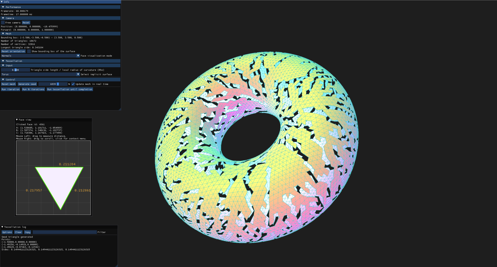

# implicit-surface-triangulation: Generate high quality meshes for implicit surfaces

# Description
This project is an implementation of the method described in the paper 
[High Quality, Curvature Dependent Triangulation of Implicit Surfaces](https://research.cs.queensu.ca/home/jstewart/papers/cga01.pdf)
